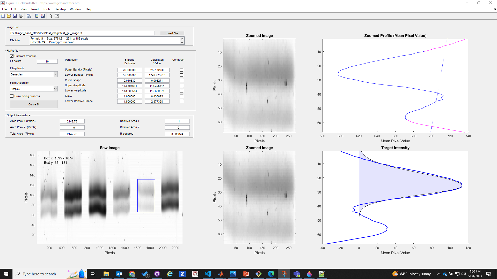
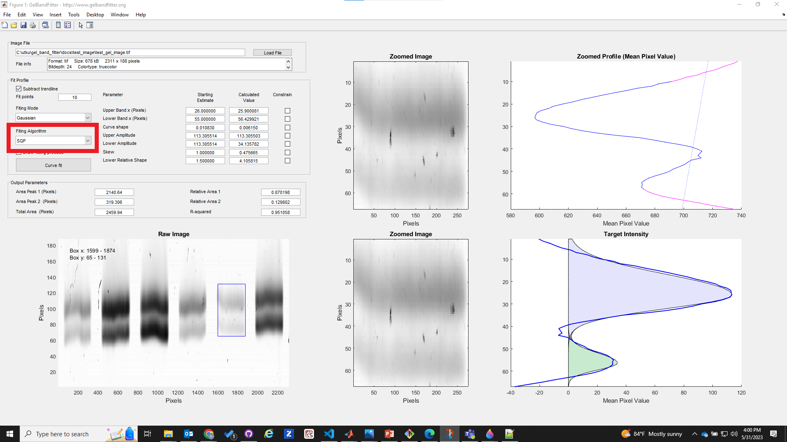
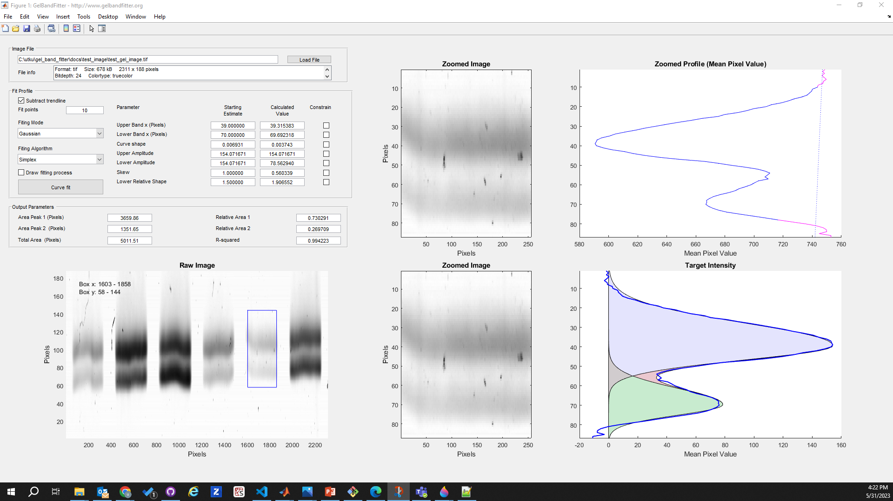
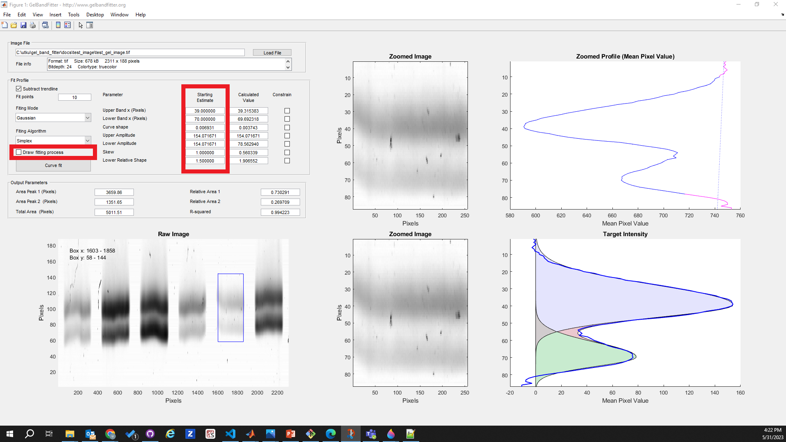
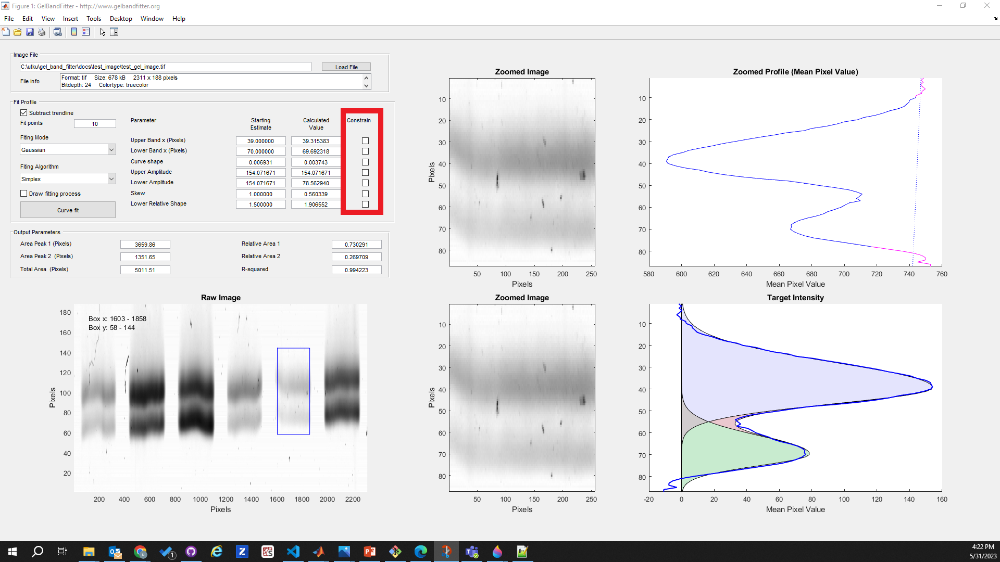

# Troubleshooting

## The Curve-fit looks strange

Here's an example of a situation that you might encounter with your own gels. Note that the curve in the bottom right axes doesn't seem to fit the experimental profile properly. You might also notice that the r2 value in the 'Output Parameters' panel is low. This value indicates how well the calculated function fits the measured profile (values > ~0.98 are 'good' - they can't be more than 1.00).

Clicking on any of the images on this page will open a larger version in a new browswer window.

The problem here is that the software hasn't managed to find a good fit. There are two distinct possibilities.

+ There isn't a good mathematical fit to the experimentally-measured profile, and
+ There is a good fit and GelBandFitter didn't find it.

It is not always easy to tell which situation it is. If you suspect it is the former, you can try fitting the other functional form (Gaussian or Lorentzian) provided by the software. If neither of these works, you have some additional options.

*Try a different optimization algorithm*

You can do this by changing the Fitting Algorithm (in the red rectangle). GelBandFitter provides two different algorithms (Simplex and SQP). In this example, the SQP algorithm found an okay fit while the Gaussian function fails.

*Try moving the selection box*

GelBandFitter may be being 'thrown' by a couple of bad pixels. You might be able to eliminate this effect by selecting a slightly different portion of your gel.

Note that the Simplex algorithm worked well with the new box.

*Try different starting values*

Multidimensional optimization (the technique used to do the curve-fitting) works by adjusting parameter values to see if it improves the fit. It works best when the 'starting values' are 'nearly right'. You may be able to help GelBandFitter converge to a good fit by changing the starting values of some of the parameters. You can do this by changing the numbers in the "Starting Estimates" boxes (in red rectangle below).

You may find it helpful to draw the fitting process (the checkbox in the red rectangle below) to see what GelBandFitter is trying to do when you adjust the values. Note that the adjustments that you make may be easier to interpret if you are using the Simplex rather than the SQL algorithm. This is to do with the way that these different techniques adjust the parameter values. It's probably not a good idea to draw the curve-fits all the time because this slows down the fitting procedures.

*Constrain one or more parameters*

If you think that GelBandFitter is setting a parameter inappropriately, you can force GelBandFitter to keep a parameter value fixed at the starting estimate (which you can override if you want by typing in your new number). This is called "constraining parameters". To do it, simply check the appropriate boxes (in red rectangle).

Note that the result is unlikely to be the 'best fit' anymore. It will be the best-fit with the parameters that you set.

