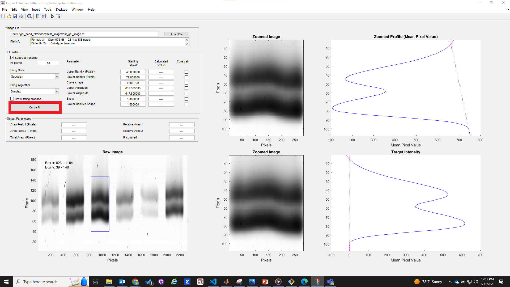

# Tutorial

This page provides simple instructions on how to use GelBandFitter.

## Instructions

+ Launch MATLAB and open `GelBandFitter.m`
+ Press <kbd>F5</kbd> to run the file.

After a few seconds, you should see a large program window that fills your entire screen. This is the main GelBandFitter program. (Clicking on any of the images on this page will open a larger version in a new browswer window.)

The first step in using GelBandFitter is to load an image file. You do this by clicking the 'Load File' button, which is highlighted in red rectangle in the image below.

This button brings up a normal Windows File Open Dialog. Use this to load an image file. GelBandFitter will open a wide range of different files including jpgs, tiffs, bmps and pngs.

You can download the test image used in this tutorial <a download = "test_gel_image.tif" href="../../test_image/test_gel_image.tif">here</a>.

An image of your gel should now be displayed in the bottom left of your screen. Note that it might appear distorted because it has been 'stretched' to fit the axes.

You can now use the mouse to drag a box to define the part of the gel that you want to analyze. The coordinates defining the box will be displayed at the top left of the raw gel image. The selected region will be shown enlarged in two places on the right-hand side of the screen. The mean pixel intensity in horizontal line in the selected region will be shown in the axes at the top right. The optical density profile will be shown at the bottom right.

GelBandFitter starts in the Manual (also called Split) mode. It assumes that you wish to calculate the relative contents of two proteins in your band profile and does this by splitting the band pattern at an appropriate point. In the example below, there is a clear minimum in the inter-peak profile and GelBandFitter splits the bands with a horizontal line at this point. GelBandFitter doesn't always make a 'good' automatic decision about where to split the bands. You can override its choice by clicking at a new point on the image.

In the example below, the area of the top region (magenta) is 15369 square pixels. The area of the bottom region (green) is 15934 square pixels. The relative area of the bottom band is therefore (15934/(15934+15369)) = 0.509. The appropriate numbers are displayed in the panel labeled 'OutputParameters'.

Many gels have non-uniform background staining. This means that the average background is different at the top and bottom of the gel. GelBandFitter can try to remove this effect by subtracting a trendline from the data. This mode is 'on' by default, but you can subtract it by clicking the 'Subtract Trendline' checkbox circled in the image below. Note how unchecking the box changes the output calculation. The trendline that 'could be removed' is shown by the dotted line in the right hand graphs.

*Make sure that the trendline correction is active before continuing*.

The Manual or Split method is probably not the best way of determining the relative content of two bands. GelBandFitter was developed to make it easy to calculate the relative content using non-linear regression techniques. To do this, change the Fitting mode to Gaussian. The relevant control is circled in the image below. You could also chose to set the function control to Lorentzian - this is simply a different form of curve. In your own application, you should use whichever function fits the experimental profile the best.

When you select the function, the two regions are removed from the target intensity graph in the bottom right of the screen. The output parameters in the middle left are also reset. Finally, numbers appear in the "Starting Estimate" column in the Fit Profile panel.

Curve-fitting is an iterative process - that means you start with a guess and try to improve it a little bit at a time. The initial guess for the function parameters are shown in the starting estimate boxes. These are calculated automatically for you. To start the curve-fitting, press the Curve-fit button (in red rectanagle below).

After a few seconds, you should see new shapes in the axes in the bottom right of the screen. These are the best-fits of two overlapping Gaussians to the measured densitometry profile. The relative areas are shown in the Output Parameters panel. Note that this method calculated the relative area of the bottom band as 0.583 (a value 16% greater than the Split method).

You can also visualize the fitting process, by checking the Draw fitting process box (in red rectangle below).

Following pressing Curve fit, the fit starts to show each iteration of the fitting process. Please note that this may take a little bit longer as a result of the plotting.

<video src="https://github.com/Campbell-Muscle-Lab/GelBandFitter/assets/98066302/01e91932-f61c-459c-9e6c-8f5cf1f14134" controls="controls" style="max-width: 730px;"></video>

